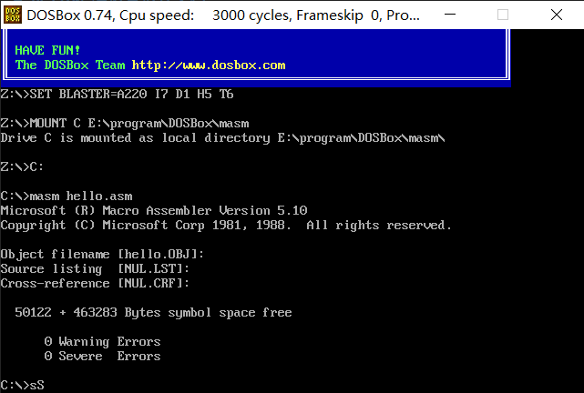
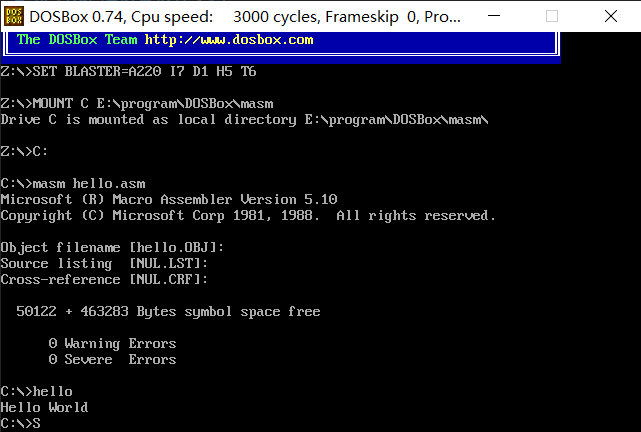
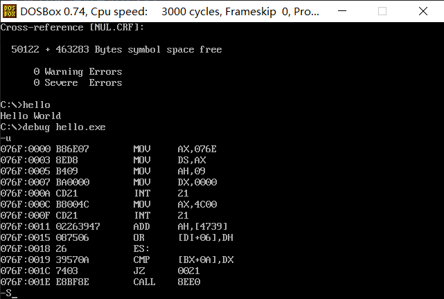
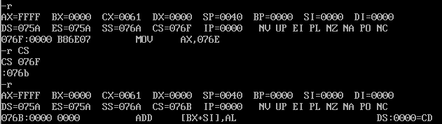
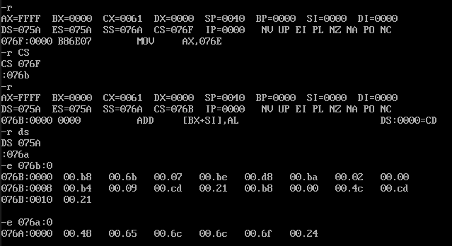

# hello汇编语言运行文档
## 传统方式
### 1.创建hello.asm文件，代码如下：

```
STKSEG SEGMENT STACK
DW 32 DUP(0)
STKSEG ENDS

DATASEG SEGMENT
	MSG DB "Hello$"
DATASEG ENDS

CODESEG SEGMENT
	ASSUME CS:CODESEG,DS:DATASEG
MAIN PROC FAR
	MOV AX,DATASEG
	MOV DS,AX 
	MOV AH,9
	LEA DX,MSG
	INT 21H
	MOV AX,4C00H
	INT 21H
MAIN ENDP
CODESEG ENDS
	END MAIN
```
### 2.汇编及链接
1. 打开DOSBox.exe，输入masm hello.asm，并设置生成的相关文件名


2. 输入hello，即可运行hello.exe


3. 输入debug hello.exe，输入-u，可查看反汇编详情


## 另类执行方式
### 1.在上述汇编阶段设置.lst文件名
可以查看地址、内容、源码等的对应关系（汇编时.lst文件名默认为null，即不生成.lst文件）

### 2.查看寄存器地址
在debug时输入-r，可看到所有寄存器的地址
且输入-r *(寄存器名)，回车后可修改寄存器地址


### 3.直接写内存方式执行代码
1. 写代码的机器码
将 b8 6b 07 be d8 ba 02 00 b4 09 cd 21 b8 00 4c cd 21（17 个字节）写入内存
Debug下用‐e 076b: 0 回车 一次写入（相当于写入 CS：076B

2. 写数据
将”Hello$”对应的 ASCII 码 48 65 6c 6c 6f 24 写入内存
与上一步相同的方法写入debug -e 076a: 0


//该图为修改CS、DS寄存器后，写入机器码及数据的过程

3. 执行
输入-g

