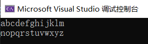
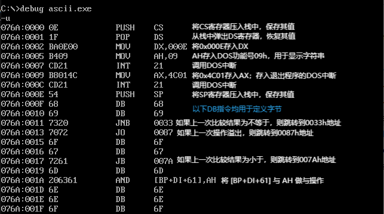

# Ascii作业文档
### c语言代码

```
#include <stdio.h>

int main() {
    char letter;
    int count = 0;

    for (letter = 'a'; letter <= 'z'; letter++) {
        printf("%c", letter);
        count++;

        if (count == 13) {
            printf("\n");
            count = 0;
        }
    }

    return 0;
}
```

### 运行结果


### 反汇编结果及注释

