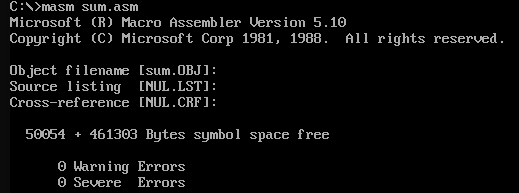
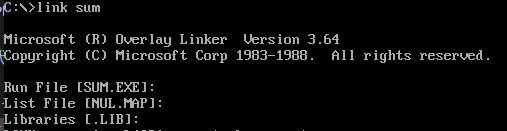
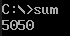
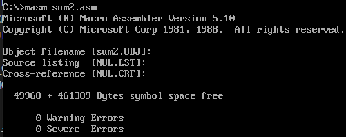
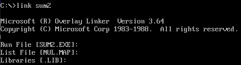
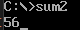
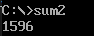
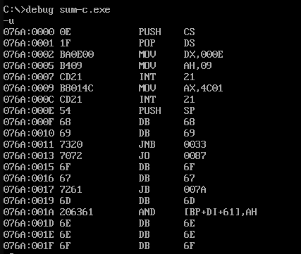

# 求和作业文档

## 基本求和

具体代码详见sum.asm

1. 主要累加循环代码

```
L:
    ADD AX, BX ;方法一：将和存入寄存器
    INC BX ;BX每次加 1
    CMP BX, 100
    JLE L ;如果BX小于100，继续循环

    MOV SUM, AX ;方法二：将和存入数据段

    PUSH AX ;方法三：将和存入栈中
``` 
上述代码中利用了三种方法存储结果

2. 编译运行





## 用户输入数字累加求和

具体代码详见sum2.asm

1. 核心代码
获取输入字符串并转换为数字：
 ```
    MOV AH, 0AH ;DOS函数：读取字符串
    LEA DX, INPUT ;加载输入缓冲区地址
    INT 21H

    ; 将输入的字符转换为数字
    MOV SI, OFFSET INPUT + 2 ;SI指向输入缓冲区
    MOV CL, [INPUT + 1] ;输入的字符数量
    MOV AX, 0
    MOV DI, 0

CONVERT:
    MOV DL, [SI]
    CMP DL, 0
    JE DONE_CONVERT
    SUB DL, 30H ;转换字符到数字

    MOV BX, AX
    MOV AX, 10
    MUL BL
    ADD AX, DX ;AX=AX*10+DX

    INC DI ;移动到下一个字符
    INC SI ;SI移动到下一个字符
    CMP DI, CX
    JL CONVERT ;如果DI小于字符数量，继续循环

DONE_CONVERT:
    MOV SUM, AX ;将输入的数字存入SUM
 ```

2. 编译运行





运行后可输入1-100的数字，此处输入了56


回车后打印累加和为1569


## c语言反编译
1. c语言代码
详见sum.c
```
#include <stdio.h>

int main() {
    int sum = 0;
    for (int i = 1; i < 101; i++) {
        sum += i;
    }
    printf("%d\n", sum);
    return 0;
}
```

2. 反编译


相关解析：
```
PUSH CS：将CS寄存器的值存到栈中
POP DS：从栈中弹出值，存储到DS中
MOV DX, 000E：将000E存到DX中
MOV AH, 09：用于输出字符串的中断功能号
INT 21：调用DOS中断
MOV AX, 4C01：将4C01存到AX中
INT 21：调用DOS中断
PUSH SP：将SP的值存到栈中
DB指令均为定义字节数据
JNB 0033：如果进位标志CF = 0，则程序将跳转到指定的目标地址0033
JO 0087：如果溢出标志OF = 1，则程序将跳转到指定的目标地址0087
JB 007A：如果进位标志CF = 1，则程序将跳转到指定的目标地址007A
AND [BP+DI+611], AH：对地址BP+DI+611上的值和AH寄存器的值做逻辑按位与操作
```

## 心得
1. 打印时需要将数字数据按位转换为ascii码并存储，才能打印出对应字符串
2. 用户输入部分代码需要设置缓冲区大小，否则无法进行输出操作，就会直接进行后续的累加操作，导致数值错误
3. 在将输入的字符串转换成数字时，需要格外注意缓冲区字符串每位的位置，逐位进行转化
4. 逐位转化数字时，需要将每位数字对应乘10；乘法操作时默认从AX或AL中取乘数，因此若AX中数字需要做乘法时，需要利用其他寄存器运算，否则会出现AX自乘。

