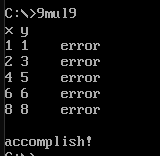

# 99乘法表作业文档

## 打印99乘法表

具体代码详见9.asm

1. 打印一行乘法表代码
```
PrintOneLine PROC

    PUSH CX
    PUSH AX
    MOV NUM2, 1 ;变化的乘数
    MOV NUM1, AX

OneLineLoop:
    MOV BX, NUM2
    MOV AX, NUM1
    ADD BL, '0' ;将变化乘数BX转换为 ASCII 字符
    ADD AL, '0' ;将固定乘数AX转换为 ASCII 字符

    ;打印当前行固定乘数AX
    MOV DL, AL
    MOV AH, 02H
    INT 21H

    ;打印乘号
    MOV DL, '*'
    MOV AH, 02H
    INT 21H

    ;打印变化的乘数
    MOV DL, BL
    MOV AH, 02H
    INT 21H

    ;打印等号
    MOV DL, '='
    MOV AH, 02H
    INT 21H

    ;进行乘法
    MOV AX, NUM1
    MOV BX, NUM2

    MUL BL
    CALL PrintResult

    MOV DL, ' '
    MOV AH, 02H
    INT 21H

    INC NUM2

    LOOP OneLineLoop

    ;换行
    MOV DX, OFFSET NEWLINE
    MOV AH, 09H
    INT 21H

    POP AX
    POP CX
    RET

PrintOneLine ENDP
```
<br>

2. 打印多位数代码
用于打印算式的乘法结果

```
PrintResult PROC
    PUSH AX
    PUSH BX
    PUSH CX

   ;转换数字为字符串
    MOV DX, 0 ;存储字符
    MOV BX, 10 ;除数
    MOV CX, 0

ConvertLoop:
    MOV DX, 0
    DIV BX ; AX = AX / 10
    ADD DL, '0' ;将DX中的余数转换为ASCII码
    PUSH DX ;在栈中存储单个字符
    INC CX
    CMP AX, 0
    JNZ ConvertLoop ;如果AX没有为0，则未转化结束

    ;打印字符串（逐个字符打印）
PrintLoop:
    POP DX
    MOV AH, 02H
    INT 21H
    LOOP PrintLoop

    POP CX
    POP BX
    POP AX
    
    RET
PrintResult ENDP
```
<br>

3. 运行结果

<br>

4. 心得

* PrintOneLine过程将每行乘法表的固定乘数和变化乘数存入数据段，循环相乘，以固定乘数为循环次数；循环打印固定乘数和变化乘数及各种符号字符，再调用PrintResult过程打印多位数的乘积

* 汇编语言的寄存器不像高级语言的变量可以有很多个，且部分寄存器的作用较多（如AX、CX），可以使用数据段、栈的方式存储数据，防止数据在寄存器中混淆或变化。

* 使用栈暂存数据时，PUSH和POP要对应使用，防止数据丢失


## 99乘法表纠错

具体代码详见9mul9.asm

1. 核心代码
```
OuterLOOP:
    PUSH CX

    MOV CX, 9
    MOV COL, 0
InnerLoop:
    MOV BX, ROW
    MOV AX, COL

    INC BX
    INC AX

    MUL BL ;得出当前位置期望结果

    MOV BX, [SI]

    CMP AL, BL ;不能用AX和BX（中断等操作会导致AH变化使其不为0，导致判断出错）
    JE S

    ;打印错误信息
    MOV BX, ROW
    INC BX
    ADD BL, '0'
    MOV DL, BL
    MOV AH, 02H
    INT 21H

    MOV DL, ' '
    MOV AH, 02H
    INT 21H

    MOV AX, COL
    INC AX
    ADD AL, '0'
    MOV DL, AL
    MOV AH, 02H
    INT 21H

    MOV AH, 09H
    MOV DX, OFFSET ERR
    INT 21H

    MOV AH, 09H
    MOV DX, OFFSET NEWLINE
    INT 21H

S:
    INC SI
    INC COL
    LOOP InnerLoop

    POP CX
    INC ROW
    LOOP OuterLOOP
```
<br>

2. 运行结果

<br>

3. 心得
* 将检查位置的行列数存在数据段中，根据行列数计算该位置的期望结果，并与table中相应位置的数据进行比较，不同则打印错误信息。循环81次检查所有数据

* 减少在不同循环、过程中使用寄存器“传递”参数，多用数据段、栈存储数据

* 检查某一位数据时，想法是将期望结果和table中数据分别存入AX、BX中，进行CMP比较，便于跳转到不同的指令；注意这里不能用：
    ```
    CMP AX, BX
    ```
    应该使用
    ```
    CMP AL, BL
    ```
    debug下发现AX的高八位会在部分操作下变化，导致AL和BL相同时，AX和BX不同

* 连续打印AL和BL的值时，中断操作会导致AX寄存器发生变化；会出现先给AX和BX都赋值后，连续打印BX、AX时，AX打印结果出错

* 两层循环时寄存器的存储和恢复要注意对应
